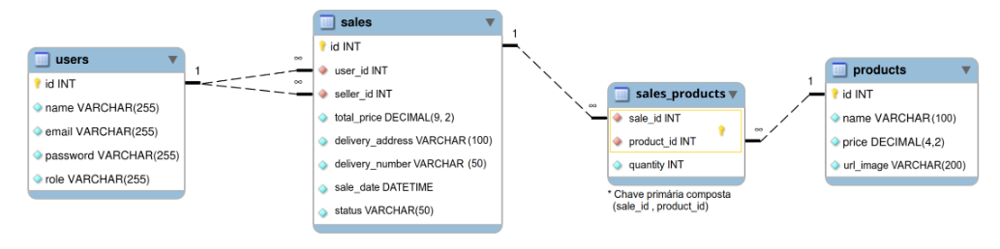

<h1>Delivery App</h1>

  Delivery App is a app for a beverage distributor. This is a full stack project that was developed in group. In the construction of the 
  front end, HTML, CSS, JavaScript, React, Context API, Axios and Jest were used. The backend was developed using Node.Js, Express, JWT, MySQL,
  Sequelize, Mocha, Chai and  Sinon. We use SCRUM practices to make our development agile and we are guided by a kanban board.

  Rafael and I were responsible for developing the front-end application. I worked on the development of all pages related to customer and seller
  interaction, as well as the login and registration pages. I also developed all the tests related to the frontend

    
 
<strong>Acknowledgement: </strong>
  

 Rafael Ribeiro: https://github.com/rafaelribeiro96; 

 Davi Almeida: https://github.com/davifalmeida; 

 Cesar Nogueira: https://github.com/cesardinogueira; 

 Jõao Espanha: https://github.com/joaoespanha;

 Trybe:  https://github.com/tryber; 

 
 

<h2> Built With </h2>

<h3>FrontEnd </h3>
  <a href="https://developer.mozilla.org/en-US/docs/Web/HTML" rel="nofollow"> - HTML </a>   
  <a href="https://developer.mozilla.org/en-US/docs/Web/CSS" rel="nofollow"> - CSS </a>   
  <a href="https://developer.mozilla.org/en-US/docs/Web/JavaScript" rel="nofollow"> - JavaScript </a>   
  <a href="https://react.dev/learn" rel="nofollow"> - React </a>   
  <a href="https://axios-http.com/ptbr/docs/intro" rel="nofollow"> - Axios </a>    
  <a href="https://jestjs.io/pt-BR/" rel="nofollow"> - Jest </a>   

 
<h3>BackEnd</h3>
 <a href="https://nodejs.org/en/" rel="nofollow"> - NodeJS </a>   
 <a href="https://expressjs.com/pt-br/" rel="nofollow"> - Express </a>   
 <a href="https://www.mysql.com/" rel="nofollow"> - MySQL </a>   
 <a href="https://sequelize.org/docs/v6/core-concepts/validations-and-constraints/" rel="nofollow"> - Sequelize </a>   
  <a href="https://jwt.io/" rel="nofollow"> - JWT </a>   
 <a href="https://mochajs.org/" rel="nofollow"> - Mocha </a>   
 <a href="https://www.chaijs.com/" rel="nofollow"> - Chai </a>   
 <a href="https://sinonjs.org/" rel="nofollow"> - Sinon </a>   

 

<h2> Entity relationship diagram </h2>

 
  

<h2>
  How try the application?
</h2>

    
 
      1 - Clone the project  
      <code>git clone git@github.com:GeorgeSantosDev/delivery-app.git</code>
    

     
    
 
     2 - Enter the project folder  
     <code>cd delivery-app</code>
    

     
    
 
     3 - Install all dependencies  
      <code>npm install</code>
    

     
    
 
     4 - Enter the frontend and backend folders and install all dependencies  
     <code>cd front-end</code>
     <code>cd back-end</code>
     <code>npm install</code>
    

     
    
 
     5 - Rename env.example file in backend folder to .env and add your connection data  
    

     
    
 
     6 - In the root of the project run the command  
     <code>npm start</code>
    

     

 
 
  

 Any questions or suggestions? Contact me 

